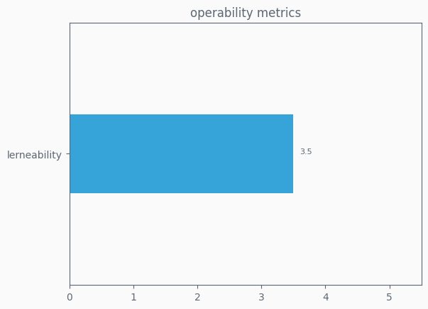
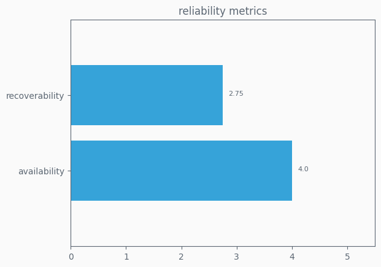
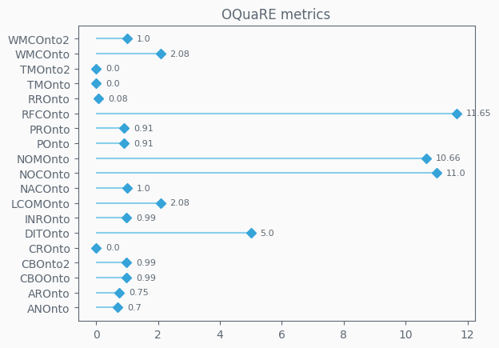

## OQuaRE model value
Represents the quality of the ontology when taking in all the values obtained after evaluation across the latest 20 versions.On a scale of 1 to 5, 5 represents the highest quality attainable according to the OQuaRE framework

	

## OQuaRE characteristics values
Each characteristic has a value on a scale of 1 to 5, indicating how good the ontology is for each characteristics

	

## OQuaRE subcharacteristics metrics
Each characteristic has a set of subcharacteristics with metrics on a scale of 1 to 5, which makes up the characteristics end value

	
	
	
	
	
	
	

## OQuaRE metrics values
Fine grained metrics, lowest level of ontology analysis provided. Scaled version uses a 1 to 5 scale

	
	

